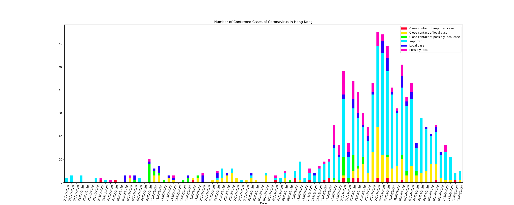

# Chart on Hong Kong COVID-19 Confirmed Cases

This tool is to generate the chart on the daily confirmed cases showing the case classifications.



## Prerequisite

Please make sure the below packages have been installed

- Requests
- Pandas
- NumPy
- Matplotlib

## How to use

Execute the below command and a PNG file will be generated in the `charts` directory, with the file name containing the latest date provided in the dataset.

```
daily-count-chart-20200717.png
```

The PNG file will be overwritten if the same file name is generated.

```bash
python daily-count.py
```